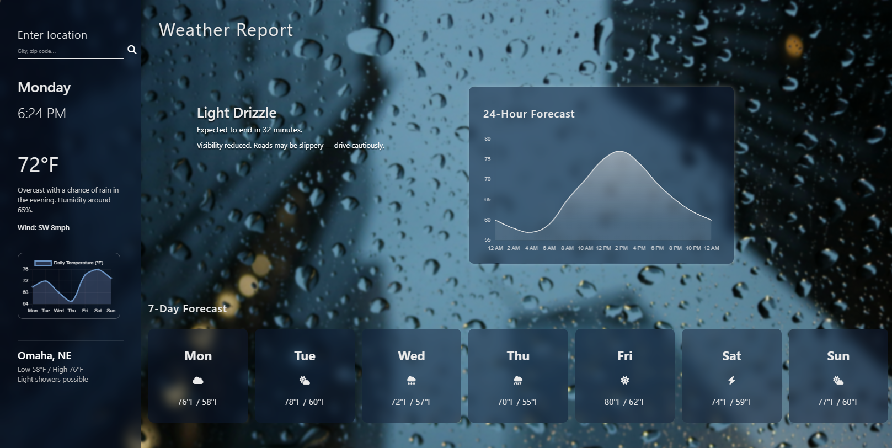

# WeatherSite

A modern weather web app mockup featuring a glass-style dark UI. This front-end design is built with HTML, CSS, and JavaScript, using Chart.js for data visualization. The layout includes real-time-style temperature charts, a location input, and responsive elements inspired by live weather dashboards

## 📸 Screenshots

### Rainy Weather

### Sunny Weather

